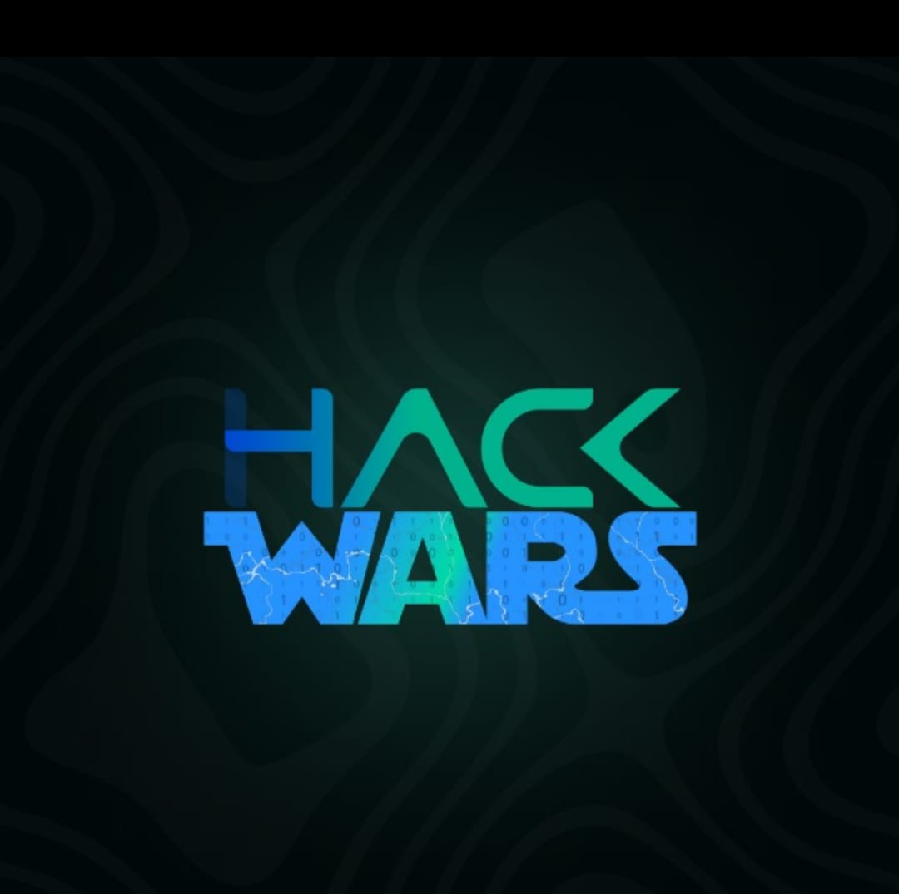
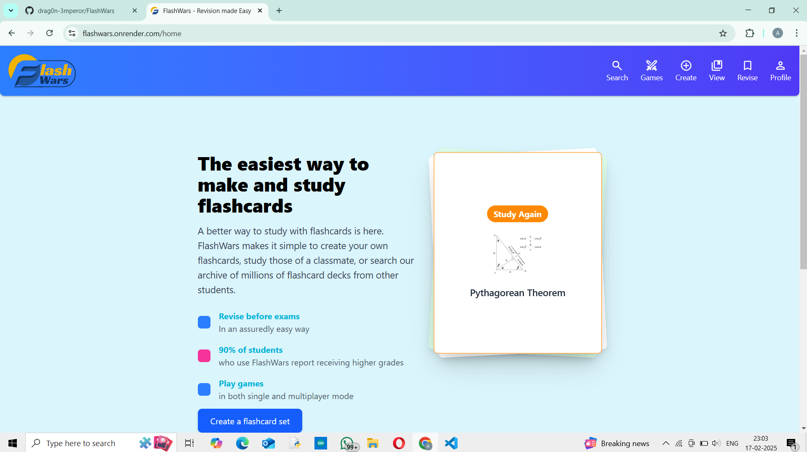
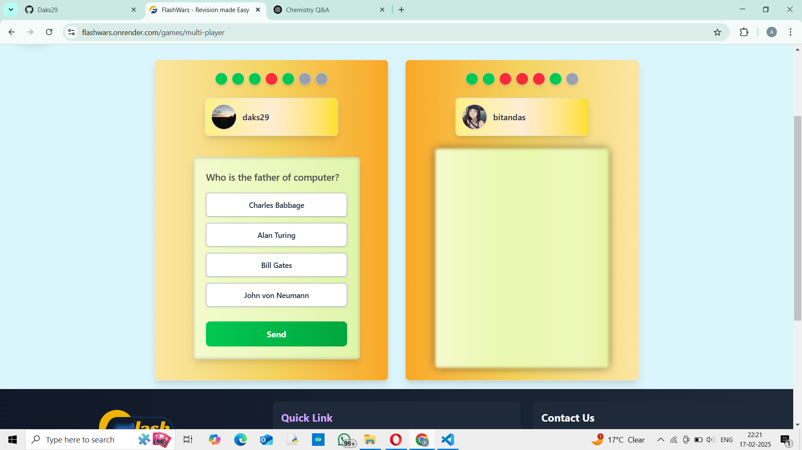
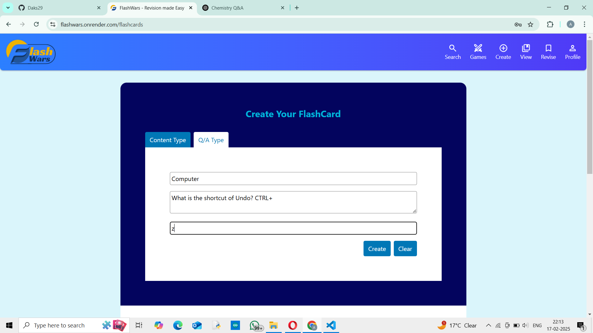
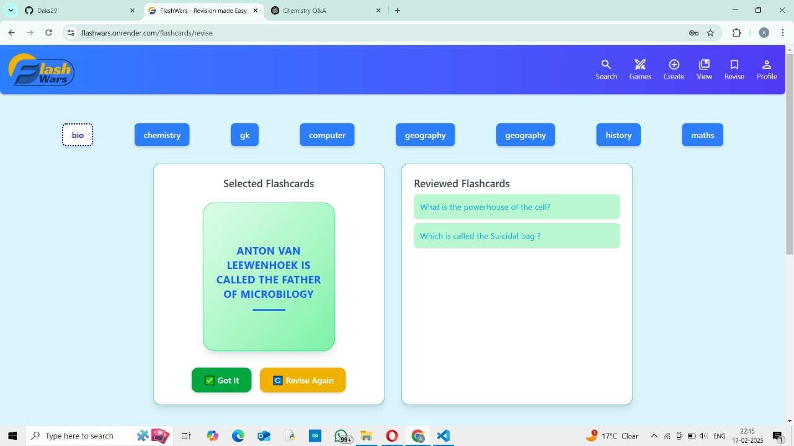
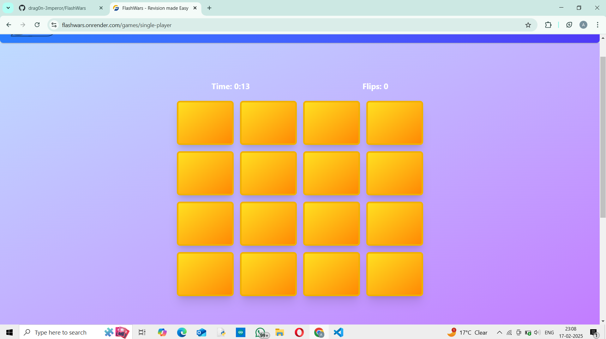

# 
FlashWars

<i>
FlashWars is an interactive platform where users can create flashcards, play games like tile flipping, and engage in multiplayer combat while exploring others' websites.
</i>

# 🎥Demo 

# Table of Contents

1. [Featured In](#featured-in)
2. [About Us](#about-us)
3. [Tech Stack](#tech-stack)
4. [Installation Instructions](#installation-instructions)
5. [Our Contributors](#our-contributors)
6. [Website Preview](#website-preview)

## Featured In 
<table>

   <tr>
      <th>Event Logo</th>
      <th>Event Name</th>
      <th>Event Description</th>
   </tr>
   <tr>
        <td></td>
        <td><a href="https://www.socialwinterofcode.com/">Hackwars
        </a>2025</td>
       <td>
HackWars is a week-long hackathon designed to introduce first- and second-year students of Jalpaiguri Government Engineering College to the world of open source. Throughout the 7-day event, selected participants will have the opportunity to collaborate on an exciting, fully functional project, receiving mentorship from experienced seniors to enhance their skills and contribute meaningfully to the open-source community.
</td>
    </tr>
   
</table>

## About Us

Welcome to FlashWars! 🌕✨The, the ultimate platform for learning, gaming, and creativity! Our mission is to revolutionize the way people engage with learning and interactive experiences by combining flashcard creation, exciting games, and an active community in one place. Whether you’re a student, a professional, or someone looking to challenge their memory and skills, FlashWars offers a dynamic and fun environment for all.

At FlashWars, we believe that learning should be engaging, enjoyable, and interactive. Our platform is designed to make studying and knowledge-sharing fun by gamifying the learning process. We aim to create a space where users can not only build and test their own flashcards but also enjoy various games like tile flipping and multiplayer combat while connecting with others in a global community.

Ready to take your learning to the next level? Create an account, start building your flashcards, play games, and connect with a global community of learners. FlashWars is more than just a platform – it's an experience!

Let’s make learning fun again with FlashWars – where knowledge meets play! 🌸🕰

.

## 
Tech Stack

 
Used for storing and managing data in a flexible, document-oriented NoSQL database.
   
A minimal web application framework for Node.js to build server-side applications and APIs.
   
A JavaScript library for building user interfaces, especially for dynamic, single-page applications.
   
A runtime environment for executing JavaScript code server-side, powering backend services and APIs

   
Enables real-time, bidirectional communication between the server and client, ideal for chat apps and live data updates.

   
A utility-first CSS framework for rapidly building custom user interfaces with pre-defined classes.
 

  

## 
Installation Instructions

Follow the steps below to set up and run the project locally:

## 1. Clone the Repository
Clone the repository to your local machine using the following command:
bash
https://github.com/drag0n-3mperor/FlashWars.git

## 2. Run the Frontend
The frontend is a static application. To run it:
1. Navigate to the frontend folder.
2. Run the command 
bash
npm install
npm run dev

## 3. Run the Backend

### 1. Prerequisites
Before running the backend, ensure the following software is installed on your machine:
- *Node.js*: Install a compatible version for the project. [Download Node.js](https://nodejs.org/)  
- *Git*: Version control system. [Download Git](https://git-scm.com/)  

### 2. Navigate to Backend
Change your directory to the backend folder:
bash
cd server

## *4. Start the Backend*
1. Run the following command
   bash
   npm install
   npm run dev
   

2. The backend should now be running on http://localhost:3000.

 

 

## Website Preview📸
 

🌐 *Visit our website:* [FlashWars](https://flashwars.onrender.com/)  
 

 ## <h2 style="font-size:3rem;">Our Team </h2>
  <h3>We are a dynamic and dedicated team focused on Flashwars, committed to achieving excellence and fostering collaboration</h3>
🌐 <a href="https://github.com/drag0n-3mperor">BITAN DAS</a>
🌐 <a href="https://github.com/sarbik99">SARBIK CHATTERJEE</a>
🌐 <a href="https://github.com/daks29">ANKIT GHOSH</a>
 

    

<h3 style="font-size:2rem;">
If you find this project helpful, please consider giving it a star! 

